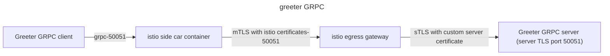

# istio examples

## Overview

The repository contains example configurations of istio service mesh

## Prerequisites

- Install:

  - [docker](https://www.docker.com)
  - [kubectl](https://kubernetes.io/docs/reference/kubectl/)
  - [golang](https://go.dev)

- Install [k3d](https://github.com/k3d-io/k3d) to run Kubernetes in docker containers.

- Create an image registry that will be visible from inside the Kubernetes cluster:

```
k3d registry create registry.localhost --port 5000
```

- Create a cluster and use the registry:

```bash
k3d create cluster mycluster --registry-use k3d-registry.localhost:5000
```

- Install istio with istioctl [istioctl](https://istio.io/latest/docs/setup/install/istioctl).

- Install the istio operator using the provided file.

```bash
istioctl install -f istiocfg.yml
```

The file is the same as demo profile (`istioctl profile dump demo`) with the following exceptions:

    * The egress gateway service listens on additional port 50051

- Get the IP of the host

```bash
myip=$(ip -o route get to 8.8.8.8 | sed -n 's/.*src \([0-9.]\+\).*/\1/p')
echo $myip
```

- Add the following hostnames in coreDNS configmap

```
currentNodeHosts=$(kubectl -n kube-system get cm coredns -o=jsonpath='{.data.NodeHosts}' )
kubectl patch configmap/coredns \
  -n kube-system \
  --type merge \
  -p '{"data":{"NodeHosts":"'$currentNodeHosts'\n'$myip' www.greeter.com"}}'
```

- Restart coreDNS

```
kubectl -n kube-system rollout restart deployment coredns
```

## Examples

### Access a GRPC external service through an egress gateway originating TLS connection

The example runs a GRPC hello world server on port 50051 with TLS.
The GRPC client and server directly comes from [go-grpc](https://github.com/grpc/grpc-go). The client has been modified to loop on requests and the server to listen on a TLS port.
A GRPC client inside the cluster connects to it in clear, istio side car container performs mTLS to the istio egressgateway and sTLS to the server



- Build a docker image for the cient and push it to the local registry

```
cd greeter-grpc/greeter_client
docker build -t localhost:5000/greeter_client:latest .
docker push localhost:5000/greeter_client:latest
```

- Build and start the server

```
cd greeter-grpc/greeter_server
go build -v
./greeter_server
```

- In another shell, deploy the client and istio configuration in a dedicated namespace called greeter

```bash
kubectl apply -f greeter-grpc-istio-egressgw-tls-originating.yml

```

After a few seconds the server should display message like the following:

```
2024/03/09 18:21:57 Received: world
```
